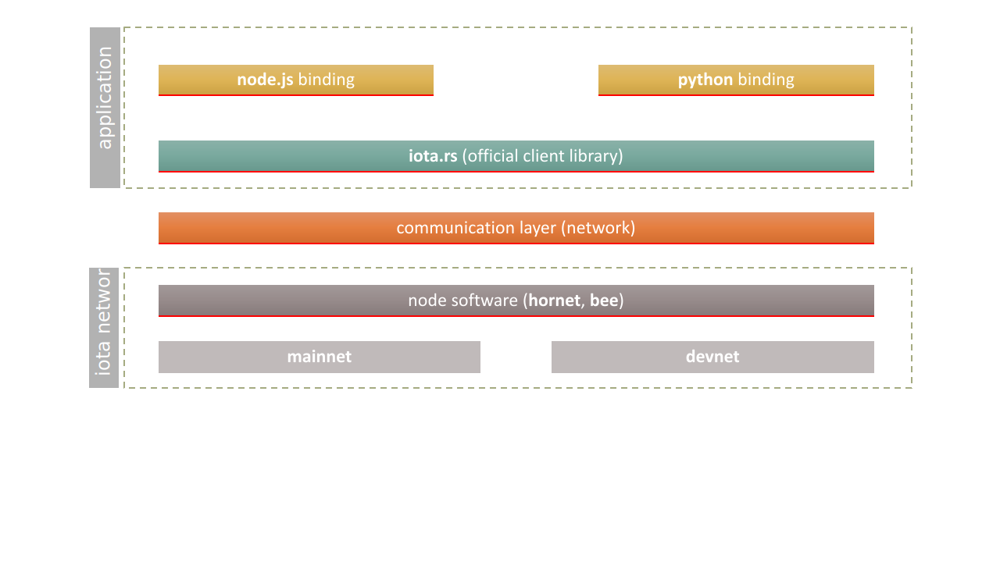

# Overview

The IOTA client library is a stateless library that provides a high level abstractions on top of IOTA node software to help interact with IOTA network in user friendly way and allows you to do the following, for instance:

- Create messages and transactions
- Sign transactions
- Generate addresses
- Interact with an IOTA node

## IOTA client library in a nutshell
The library provides two types of API calls under a common interface:
* `Full node API calls`: those calls are basically translated to native node rest api calls. For more information, please see [node rest API reference](https://editor.swagger.io/?url=https://raw.githubusercontent.com/rufsam/protocol-rfcs/master/text/0026-rest-api/rest-api.yaml)
* `General high level API calls`: those are convenience functions with some typical default parameters in order to use them in a straightforward manner. They typically implement several recommended steps for the given task. Implementation details are part of the full specification

See the full specification [here](../specs/README.md).

## High level layered overview:
